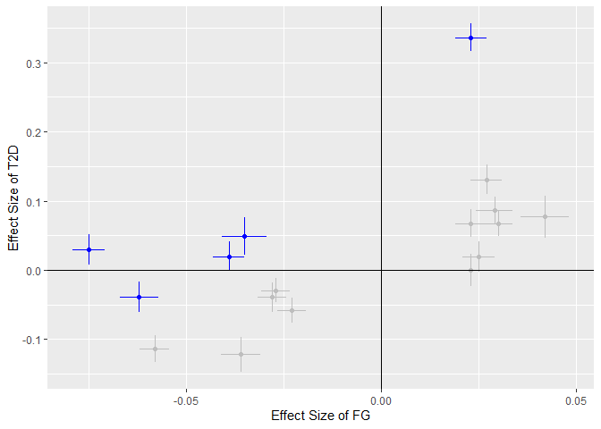

<!-- README.md is generated from README.Rmd. Please edit that file -->

# MRcML for Independent Samples and Overlapping Samples

<!-- badges: start -->
<!-- badges: end -->

R package for Mendelian randomization with constraind maximum likelihood
(MRcML) methods. Here is the reference for the original MRcML method
with two independent samples: [**Constrained maximum likelihood-based
Mendelian randomization robust to both correlated and uncorrelated
pleiotropic
effects**](https://www.cell.com/ajhg/pdfExtended/S0002-9297(21)00219-6).
Here is the reference for the extension of MRcML method with overlapping
samples: [**Combining Mendelian randomization and network deconvolution
for inference of causal networks with GWAS summary
data**](https://journals.plos.org/plosgenetics/article?id=10.1371/journal.pgen.1010762).

## Installation

<!-- You can install the released version of MRcML from [CRAN](https://CRAN.R-project.org) with:
&#10;``` r
install.packages("MRcML")
```
-->

Install the package from [GitHub](https://github.com/) with:

``` r
# install.packages("devtools")
devtools::install_github("xue-hr/MRcML")
```

## Example

Here is an example which shows how to apply MRcML methods to make
inference about the causal effect from **Fast Glucose (FG)** to **Type-2
Diabetes (T2D)**.

``` r
library(MRcML)
summary(T2D_FG)
#>        Length Class  Mode   
#> b_exp  17     -none- numeric
#> b_out  17     -none- numeric
#> se_exp 17     -none- numeric
#> se_out 17     -none- numeric
```

Example data `T2D_FG` is a list which contains estimated effects sizes
and standard errors of 17 SNPs on T2D and FG. Now we perfrom the main
function with sample size of FG which is 46186, and using 100 random
start points. We set the random seed `random_seed = 1` to make sure
results are replicable. First we use the function `mr_cML()`, which is
for the two independent sample case. Then we apply the function
`mr_cML_Overlap()`, which is for the overlapping sample case; for
illustration purpose, here we assume the correlations between GWAS
summary data being 0.1, i.e. setting `rho = 0.1`.

``` r
### mr_cML() for two independent samples
cML_result = mr_cML(T2D_FG$b_exp,
                    T2D_FG$b_out,
                    T2D_FG$se_exp,
                    T2D_FG$se_out,
                    n = 46186,
                    random_start = 100,
                    random_seed = 1)
#> Warning in cML_estimate_random(b_exp = b_exp, b_out = b_out, se_exp = se_exp, :
#> May not converge to minimums with some given start points and maximum number of
#> iteration, lead to Fisher Information matrices not positive definite. Could try
#> increasing number of iterations (maxit) or try different start points. Note: If
#> multiple random start points are used, this warning does not likely affect
#> result.

### mr_cML_Overlap() for two overlapping samples
cML_result_Overlap = mr_cML_Overlap(T2D_FG$b_exp,
                                    T2D_FG$b_out,
                                    T2D_FG$se_exp,
                                    T2D_FG$se_out,
                                    n = 46186,
                                    random_start = 100,
                                    random_seed = 1,
                                    rho = 0.1)
```

We get a warning message from the function `cML_estimate_random()`. The
reason is: here we use 100 random starting points to minimize the
non-convex loss function, some of them may not converge to a local
minimum and result in Fisher Information matrices that are not positive
definite. It is not likely affecting the optimization result, since in
the end we only use the start point gives the minimum loss and discard
all other start points including those do not converge. Now lets take a
look at the results:

``` r
cML_result
#> $MA_BIC_theta
#> [1] 2.110808
#> 
#> $MA_BIC_se
#> [1] 0.2455809
#> 
#> $MA_BIC_p
#> [1] 8.314666e-18
#> 
#> $BIC_theta
#> [1] 2.236579
#> 
#> $BIC_se
#> [1] 0.2061844
#> 
#> $BIC_p
#> [1] 2.050249e-27
#> 
#> $BIC_invalid
#> [1]  8 12 13 15 17
#> 
#> $BIC_vec
#>  [1] 316.27016 114.79456  89.17168  83.95043  80.85419  78.09146  78.74102
#>  [8]  85.62170  93.12957 101.96266 110.79080 120.24385 130.04801 140.13491
#> [15] 150.51854 161.10701
#> 
#> $MA_AIC_theta
#> [1] 2.09175
#> 
#> $MA_AIC_se
#> [1] 0.3012363
#> 
#> $MA_AIC_p
#> [1] 3.814609e-12
#> 
#> $AIC_theta
#> [1] 1.996619
#> 
#> $AIC_se
#> [1] 0.2194686
#> 
#> $AIC_p
#> [1] 9.242142e-20
#> 
#> $AIC_invalid
#> [1]  1  5  8 12 13 14 15 17
cML_result_Overlap
#> $MA_BIC_theta
#> [1] 2.104823
#> 
#> $MA_BIC_se
#> [1] 0.2291103
#> 
#> $MA_BIC_p
#> [1] 4.041771e-20
#> 
#> $BIC_theta
#> [1] 2.042903
#> 
#> $BIC_se
#> [1] 0.2002188
#> 
#> $BIC_p
#> [1] 1.915521e-24
#> 
#> $BIC_invalid
#> [1]  5  8 12 13 15 17
#> 
#> $BIC_vec
#>  [1] 338.05597 119.55712  93.38677  86.95164  83.59678  79.99495  79.81302
#>  [8]  86.44247  93.67529 102.33370 111.06057 120.39637 130.13024 140.18519
#> [15] 150.53333 161.10706
```

BIC selected model gives us indices of invalid IVs: 8, 12, 13, 15, 17.
Now lets draw the scatter plot, invalid IVs are marked with blue:

    #> Warning: Using `size` aesthetic for lines was deprecated in ggplot2 3.4.0.
    #> ℹ Please use `linewidth` instead.
    #> This warning is displayed once every 8 hours.
    #> Call `lifecycle::last_lifecycle_warnings()` to see where this warning was
    #> generated.



Now let us perform cML with data perturbation. The default number of
perturbations is 200, and we use 10 random start points. In real
application, we recommend use more random start points to get reliable
results even it takes more time, like 10 or even 100; in simulations the
number of random start points could be set to 0 (i.e. do not use random
start) to speed up. First we use the function `mr_cML_DP()`, which is
for the two independent sample case. Then we apply the function
`mr_cML_DP_Overlap()`, which is for the overlapping sample case; again
for illustration purpose, here we assume the correlations between GWAS
summary data being 0.1, i.e. setting `rho = 0.1`.

``` r
### mr_cML_DP() for two independent samples
cML_result_DP = mr_cML_DP(T2D_FG$b_exp,
                          T2D_FG$b_out,
                          T2D_FG$se_exp,
                          T2D_FG$se_out,
                          n = 46186,
                          random_start = 10,
                          random_start_pert = 10,
                          random_seed = 1,
                          num_pert = 200)

### mr_cML_DP_Overlap() for two overlapping samples
cML_result_DP_Overlap = mr_cML_DP_Overlap(b_exp = T2D_FG$b_exp,
                                          b_out = T2D_FG$b_out,
                                          se_exp = T2D_FG$se_exp,
                                          se_out = T2D_FG$se_out,
                                          n = 46186,
                                          random_start = 10,
                                          random_start_pert = 10,
                                          random_seed = 1,
                                          num_pert = 200,
                                          rho = 0.1)
```

Results with data perturbation:

``` r
cML_result_DP
#> $MA_BIC_theta
#> [1] 2.110809
#> 
#> $MA_BIC_se
#> [1] 0.2455808
#> 
#> $MA_BIC_p
#> [1] 8.313889e-18
#> 
#> $BIC_theta
#> [1] 2.236579
#> 
#> $BIC_se
#> [1] 0.2061844
#> 
#> $BIC_p
#> [1] 2.050249e-27
#> 
#> $BIC_invalid
#> [1]  8 12 13 15 17
#> 
#> $MA_BIC_DP_theta
#> [1] 1.895029
#> 
#> $MA_BIC_DP_se
#> [1] 0.5151985
#> 
#> $MA_BIC_DP_p
#> [1] 0.0002348404
#> 
#> $BIC_DP_theta
#> [1] 1.884913
#> 
#> $BIC_DP_se
#> [1] 0.5313405
#> 
#> $BIC_DP_p
#> [1] 0.0003889549
#> 
#> $GOF1_p
#> [1] 4.046025e-12
#> 
#> $GOF2_p
#> [1] 2.204418e-16
cML_result_DP_Overlap
#> $MA_BIC_theta
#> [1] 2.104824
#> 
#> $MA_BIC_se
#> [1] 0.2291098
#> 
#> $MA_BIC_p
#> [1] 4.040795e-20
#> 
#> $BIC_theta
#> [1] 2.042903
#> 
#> $BIC_se
#> [1] 0.2002188
#> 
#> $BIC_p
#> [1] 1.91552e-24
#> 
#> $BIC_invalid
#> [1]  5  8 12 13 15 17
#> 
#> $MA_BIC_DP_theta
#> [1] 1.828106
#> 
#> $MA_BIC_DP_se
#> [1] 0.44015
#> 
#> $MA_BIC_DP_p
#> [1] 3.276133e-05
#> 
#> $BIC_DP_theta
#> [1] 1.816682
#> 
#> $BIC_DP_se
#> [1] 0.520952
#> 
#> $BIC_DP_p
#> [1] 0.0004880407
```

<!-- You'll still need to render `README.Rmd` regularly, to keep `README.md` up-to-date.
&#10;You can also embed plots, for example:
&#10;
&#10;In that case, don't forget to commit and push the resulting figure files, so they display on GitHub! -->
